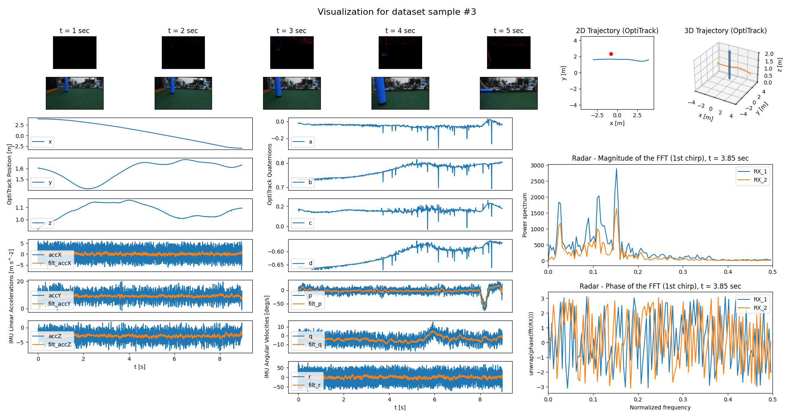

# The Obstacle Detection & Avoidance Dataset

Julien Dupeyroux, Raoul Dinaux, Nikhil Wessendorp, and Guido de Croon.  *Micro Air Vehicle Lab, Faculty of Aerospace Engineering,  Delft  University  of  Technology,  The  Netherlands.*

**Abstract** - It is now possible to make autonomous UAVs perform real feats, like autonomous drone racing (e.g., [AlphaPilot 2019 - Lockheed Martin AI Drone Racing Innovation Challenge](https://www.lockheedmartin.com/en-us/news/events/ai-innovation-challenge.html)), or aggressive maneuvers to make [MAVs cross windows](https://www.liebertpub.com/doi/full/10.1089/soro.2017.0120), or perform [aerial acrobatic maneuvers](http://www.roboticsproceedings.org/rss16/p040.pdf). Yet, it is quite disconcerting to note how difficult it is to autonomously achieve one of the most essential tasks for drones, namely, obstacle detection and avoidance. The complexity is essentially due to the difficulty to detect obstacles in the focus of expansion, where the optic flow is close to zero. This problem gets even harder in real environments where, for instance, the light intensity can change, sometimes abruptly, making it impossible to ensure the robustness of autonomous systems for obstacle detection and avoidance. In this paper, we introduce the Obstacle Avoidance Dataset for Drones, aiming at providing raw data obtained in a real indoor environment with sensors adapted for aerial robotics, and focusing on obstacle detection around the focus of expansion. Our MAV is equipped with the following sensors: (i) an event-based camera, the dynamic performance of which make it optimized for drone applications; (ii) a standard RGB camera; (iii) a 24-GHz radar sensor to enhance multi-sensory solutions; and (iv) a 6-axes IMU. The ground truth position and attitude is provided by the OptiTrack motion capture system. The resulting dataset consists in more than 1300 samples obtained in 4 distinct conditions (1 or 2 obstacles, full or dim light). It is intended for benchmarking algorithmic and neural solutions for obstacle detection and avoidance with UAVs, but also course estimation and therefore autonomous navigation.

---

The full dataset is available at:  https://link/to/the/dataset/on/4TUservers/

---

Link to the supporting data paper:  https://link/to/the/datapaper/on/arXiv

---

*This project has received funding from the ECSEL Joint Undertaking (JU) under grant agreement No. 826610. The JU receives support from the European Union's Horizon 2020 research and innovation program and Spain, Austria, Belgium, Czech Republic, France, Italy, Latvia and Netherlands.* 

---

## 1. The dataset

### 1.1. The acquisition setup

The MAV is equipped with the following sensors: 
- Event-based camera DVS240 
- 6-axes IMU sensor (gyroscope & accelerometer)
- 24-GHz Radar sensor 
- Full HD RGB camera

The ground truth position and attitude of the MAV is determined by means of the OptiTrack motion capture system available in the [Cyber Zoo](https://tudelftroboticsinstitute.nl/labs/cyber-zoo) (flying arena facility of the TU Delft).

The data are collected using a ROS environment set up onboard the Odroid XU4 flashed with Linux 16.04 Xenial. For each trial, a pilot flies the MAV towards the center of the Cyber Zoo where one or two obstacles (i.e. poles) are placed. Depending on the position of the MAV, the pilot chooses to either turn left or right (avoidance), or continue straight-forward. 

### 1.2. Availability

The dataset contains a total of **1369 trials**. For each trial, we provide the data in both **ROS bags** and **CSV** formats (DVS, IMU, Radar, OptiTrack). The videos provided by the RGB camera are made available in **.avi** format. A Python script (`convert_rosbags_to_csv.py`) allows the conversion of the dataset from ROS bags to CSV. 

### 1.3. Testing conditions

The samples were recorded under the following lighting conditions:
- Full light (100 Lux) [1286]
- Dim light (1-3 Lux) [83]

Also, we varied the number of obstacles available in the flying arena: 
- 1 obstacle [742]
- 2 obstacles [627]

The summary of these conditions is given in the `trial_overview.csv` file (in the dataset). 

---

## 2. How to use the dataset

Rendering has been performed for samples 3, 10 and 345 (samples attached to this GitHub repository for testing). Specific requirements: 

    sudo apt-get install ffmpeg
    python -m pip install scipy opencv-python

### 2.1. Using ROS Bags

If you aim at using ROS bags, you can use the following codes to render visualization for a given sample:
- `test_optitrack_ros.py`
- `test_radar_ros.py`
- `test_dvs_ros.py`
- `test_imu_ros.py`

Usage: `test_<sensor>_ros.py <ID>` where ID of the sample ranges from 1 to 1369. Some tests may result in unwanted issues (see section 2.3. below). 

One sample can also be visualized at a glance using the `sample_visualization_ros.py` script, adding the ID of the sample as first argument. See example below.

### 2.2. Using CSV files

If you aim at using CSV files, you can use the following codes to render visualization for a given sample:
- `test_optitrack_csv.py`
- `test_radar_csv.py`
- `test_dvs_csv.py`
- `test_imu_csv.py`

Usage: `test_<sensor>_csv.py <ID>` where ID of the sample ranges from 1 to 1369. Some tests may result in unwanted issues (see section 2.3. below). 

One sample can also be visualized at a glance using the `sample_visualization_csv.py` script, adding the ID of the sample as first argument. 

### 2.3. Important information

**TODO**: add all specifications about reference frames!

Please report any problem you encounter to Julien Dupeyroux (j.j.g.dupeyroux@tudelft.nl). So far, here are the known issues (already reported to the `trial_overview.csv` file):
- Samples 1306, 1321, and 1344 seem to be corrupted.
- 216 samples don't contain the RGB camera video.
- Samples 593 to 629 are missing the coordinates of the obstacle.
