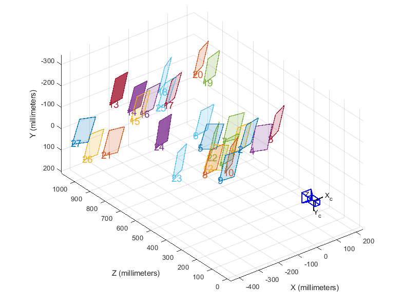

# Calibration files for the RGB camera

To determine the camera parameters, simply run `cameraCalibrator` on Matlab. For more information, please refer to https://nl.mathworks.com/help/vision/ref/cameracalibrator-app.html. The checkerboard features squares of size 24 mm. 

General information on camera calibration: https://nl.mathworks.com/help/vision/ug/camera-calibration.html. 

The camera calibration file `calib.mat` contains the following structures:
- cameraParams: contains generic information about images and the checkerboard, as well as calibration parameters such as the intrinsic matrix. 
- estimationErrors: contains error values for intrinsic and extrinsic parameters. 

Extrinsic parameters: 

