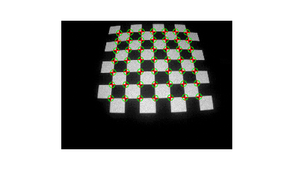
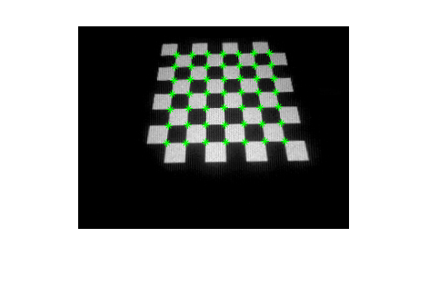
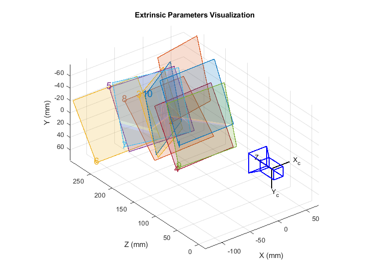
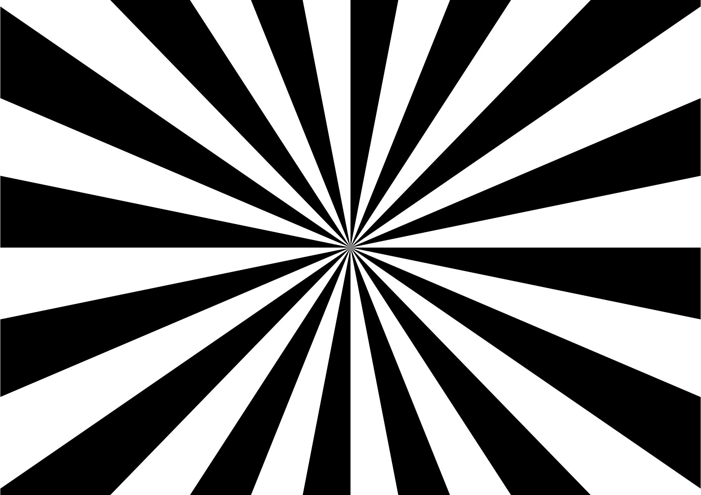

# DVS240 event-based camera calibration

The calibration parameters and distortion maps are contained in `calib.mat` within the following variables: `params`, `gridX` and `gridY` respectively. The distortion maps are also available in the `calibDVS240.h` file. 

Before compensation for distortion: 

After correction of distortion: 

Extrinsic parameters: 

---

**Steps to reproduce the calibration**

To complete the calibration of your DVS, first determine its ID by running `dmesg` after plugging in the camera. For this tutorial, the camera used is the DAVIS MONO (DVS) 0216, which will therefore display:

    [21340.984721] usb 2-1: new SuperSpeed Gen 1 USB device number 3 using xhci_hcd
    [21341.005254] usb 2-1: LPM exit latency is zeroed, disabling LPM.
    [21341.005858] usb 2-1: New USB device found, idVendor=152a, idProduct=841a, bcdDevice= 3.06
    [21341.005865] usb 2-1: New USB device strings: Mfr=1, Product=2, SerialNumber=3
    [21341.005870] usb 2-1: Product: DVS 240
    [21341.005874] usb 2-1: Manufacturer: iniVation
    [21341.005878] usb 2-1: SerialNumber: 00000216

You will also need to use the DV GUI. Follow the installation guidelines at:
 https://inivation.gitlab.io/dv/dv-docs/docs/getting-started.html 

Since the DV GUI is not available for Odroid, the calibration must be performed using your working station. 

The calibration process consists in a series of 10 acquisitions from the DVS. Run `dv-gui` in a terminal and open the `eventBasedCalibration.m` file in Matlab. Using the DV GUI, adjust the lens focus using the image below:

Run the 1st section of the code and follow the instructions. Recordings are performed by clicking on the "Record" button in the right panel of the DV GUI. Once the 10 acquisitions completed, copy the recordings to this folder and rename them `calib1.aedat4`, `calib2.aedat4`, ..., `calib10.aedat4`. Convert them to .txt files by running: 

    sh convertCalibFiles.sh
    
This will take time (10-15 min). Once done, continue the calibration by runing the next sections of the Matlab calibration file. The program will output a .mat file, and then display the undistorted maps for X and Y. Copy-paste these maps into the `calibDVS240.h` file. 

